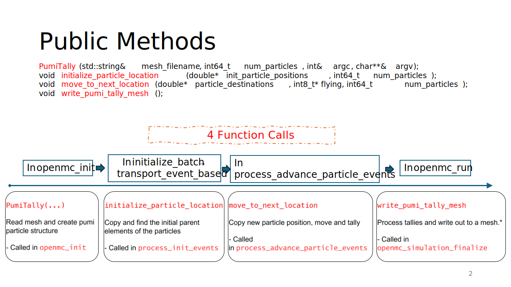

# Tallies on Unstructured Meshes

---
*Keeps track of the distances traveled by particles in each mesh
elements to be used for tallies with tracklength estimators.*

## Features

* [Pumi-PIC](https://github.com/SCOREC/pumi-pic) and [Kokkos](https://kokkos.org/) Based (GPU and OpenMP parallelism)
* Distributed Mesh and Tallies with [Omega_h](https://github.com/SCOREC/omega_h)

---


## Working Principle
The workflow is consisted of three steps:

1. Copy origins and destinations and other necessary data of particles from the monte carlo transport code.
2. Move the particles to the destination.
3. Tally the particles.

The following diagram shows the workflow in detail:


---

## Compilation
Needs the following dependencies:

1. [Pumi-PIC](https://github.com/Fuad-HH/pumi-pic/tree/add_functor_to_search_mesh)
> [!IMPORTANT]
> Only the `add_functor_to_search_mesh` branch will work on this. It can be compiled as directed by [PumiPIC Wiki](https://github.com/SCOREC/pumi-pic/wiki).

2. [Catch2](https://github.com/catchorg/Catch2)
> [!NOTE]
> Only when testing is enabled.

### Compilation on SCOREC Machines (RHEL 9)

```bash
export NVCC_WRAPPER_DEFAULT_COMPILER=/opt/scorec/spack/rhel9/v0201_4/install/linux-rhel9-x86_64/gcc-12.3.0/mpich-4.1.1-xpoyz4tqgfxtrm6m7qq67q4ccp5pnlre/bin/mpicxx
cmake -S . -B build \
  -DCMAKE_BUILD_TYPE=Release \
  -DBUILD_SHARED_LIBS=ON \
  -DCatch2_ROOT=/lore/hasanm4/otherTools/catch2/ \
  -Dpumipic_ROOT=/lore/hasanm4/wsources/pumirelated/build-pumipic-life-cuda/install/ \
  -DCabana_ROOT=/lore/hasanm4/wsources/pumirelated/build-cabana-life-cuda/install/ \
  -DCMAKE_CXX_COMPILER=/lore/hasanm4/wsources/pumirelated/build-kokkos-life-cuda/install/bin/nvcc_wrapper \
  -DCMAKE_C_COMPILER=/opt/scorec/spack/rhel9/v0201_4/install/linux-rhel9-x86_64/gcc-12.3.0/mpich-4.1.1-xpoyz4tqgfxtrm6m7qq67q4ccp5pnlre/bin/mpicc \
  -DCMAKE_INSTALL_PREFIX=build/install \
  -DPUMI_USE_KOKKOS_CUDA=ON \
  -DPUMI_MEASURE_TIME=ON

cmake --build build -j --target install
```
