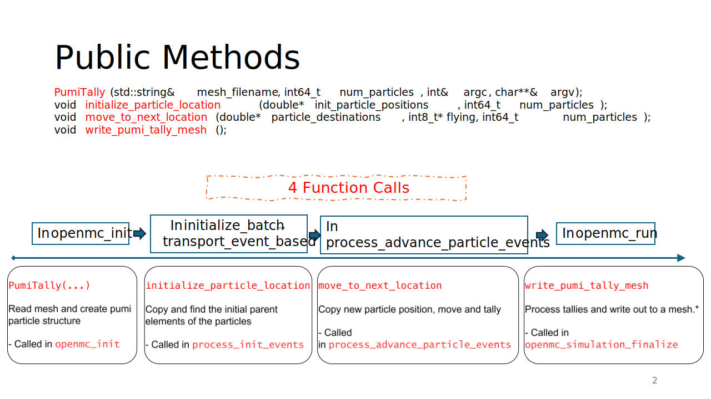

# PUMI-Tally

**GPU-accelerated unstructured mesh tallies for Monte Carlo particle transport**

PUMI-Tally accelerates unstructured mesh tallies in Monte Carlo neutral particle transport simulations by exploiting mesh adjacency information on CPUs and GPUs. Built on top of [PUMIPic](https://github.com/SCOREC/pumi-pic) and [Kokkos](https://kokkos.org/), it provides distributed parallel particle and mesh data structures with [Omega_h](https://github.com/SCOREC/omega_h).

## Installation

### Option 1: Install with Spack (recommended)

Spack automates the build of PUMI-Tally and all its dependencies.

1. **Create and activate a Spack environment**

```bash
spack env create pumi-tally-env
spack env activate pumi-tally-env
```

2. **Update the builtin Spack repo** (requires at least `releases/v2026.02`)

```bash
spack repo update builtin --branch releases/v2026.02
```

3. **Add the PUMI-PIC Spack repository**

```bash
spack repo add https://github.com/SCOREC/pumi-pic-spack.git --name pumi-pic-spack
```

4. **Add packages and install**

For OpenMC with PUMI-Tally support:

```bash
spack add openmc-pumi ^kokkos+openmp+serial
spack concretize --force
spack install
```
You may not need DAGMC but it installs OpenMC with DAGMC support by default.
Change the DAGMC spec off if you don't need it.

> [!Tip]
> For CUDA, use `^kokkos+cuda cuda_arch=<arch_code>` instead.

Verify the installation:

```bash
# If OpenMC was installed
openmc --help          # should show the --ohMesh option

# If only PUMI-Tally was installed
spack find pumi-tally
```

### Option 2: Build from source

#### Prerequisites

- C/C++ compiler (GCC 12+ recommended)
- MPI (e.g. MPICH)
- CMake >= 3.20
- zlib

Set a common install prefix for all dependencies:

```bash
export DEPS_DIR=$PWD/deps
```

#### 1. Kokkos

```bash
git clone --depth 1 --branch 4.7.00 https://github.com/kokkos/kokkos.git /tmp/kokkos
cmake -S /tmp/kokkos -B /tmp/kokkos/build \
  -DCMAKE_INSTALL_PREFIX=$DEPS_DIR \
  -DCMAKE_BUILD_TYPE=Release \
  -DKokkos_ENABLE_SERIAL=ON \
  -DKokkos_ENABLE_OPENMP=ON \
  -DBUILD_SHARED_LIBS=ON
cmake --build /tmp/kokkos/build -j$(nproc)
cmake --install /tmp/kokkos/build
```

> [!TIP]
> For CUDA support add `-DKokkos_ENABLE_CUDA=ON -DKokkos_ARCH_<arch>=ON`.

#### 2. EnGPar

```bash
git clone --depth 1 https://github.com/SCOREC/EnGPar.git /tmp/engpar
cmake -S /tmp/engpar -B /tmp/engpar/build \
  -DCMAKE_INSTALL_PREFIX=$DEPS_DIR \
  -DCMAKE_BUILD_TYPE=Release \
  -DCMAKE_CXX_COMPILER=mpicxx \
  -DCMAKE_C_COMPILER=mpicc \
  -DENABLE_PARMETIS=OFF \
  -DENABLE_PUMI=OFF \
  -DBUILD_SHARED_LIBS=ON
cmake --build /tmp/engpar/build -j$(nproc)
cmake --install /tmp/engpar/build
```

#### 3. Omega_h

```bash
git clone --depth 1 --branch scorec-v11.0.0 https://github.com/SCOREC/omega_h.git /tmp/omega_h
cmake -S /tmp/omega_h -B /tmp/omega_h/build \
  -DCMAKE_INSTALL_PREFIX=$DEPS_DIR \
  -DCMAKE_PREFIX_PATH=$DEPS_DIR \
  -DCMAKE_BUILD_TYPE=Release \
  -DCMAKE_CXX_COMPILER=mpicxx \
  -DCMAKE_C_COMPILER=mpicc \
  -DOmega_h_USE_Kokkos=ON \
  -DOmega_h_USE_MPI=ON \
  -DOmega_h_USE_ZLIB=ON \
  -DBUILD_SHARED_LIBS=ON
cmake --build /tmp/omega_h/build -j$(nproc)
cmake --install /tmp/omega_h/build
```

#### 4. Cabana

```bash
git clone --depth 1 --branch 0.6.1 https://github.com/ECP-CoPA/Cabana.git /tmp/cabana
cmake -S /tmp/cabana -B /tmp/cabana/build \
  -DCMAKE_INSTALL_PREFIX=$DEPS_DIR \
  -DCMAKE_PREFIX_PATH=$DEPS_DIR \
  -DCMAKE_BUILD_TYPE=Release \
  -DCMAKE_CXX_COMPILER=mpicxx \
  -DCMAKE_C_COMPILER=mpicc \
  -DBUILD_SHARED_LIBS=ON
cmake --build /tmp/cabana/build -j$(nproc)
cmake --install /tmp/cabana/build
```

#### 5. PUMIPic

```bash
git clone --depth 1 --branch make_search_class https://github.com/Fuad-HH/pumi-pic.git /tmp/pumi-pic
cmake -S /tmp/pumi-pic -B /tmp/pumi-pic/build \
  -DCMAKE_INSTALL_PREFIX=$DEPS_DIR \
  -DCMAKE_PREFIX_PATH=$DEPS_DIR \
  -DCMAKE_BUILD_TYPE=Release \
  -DCMAKE_CXX_COMPILER=mpicxx \
  -DCMAKE_C_COMPILER=mpicc \
  -DENABLE_CABANA=ON \
  -DBUILD_SHARED_LIBS=ON
cmake --build /tmp/pumi-pic/build -j$(nproc)
cmake --install /tmp/pumi-pic/build
```

#### 6. PUMI-Tally

```bash
cmake -S . -B build \
  -DCMAKE_PREFIX_PATH=$DEPS_DIR \
  -DCMAKE_BUILD_TYPE=Release \
  -DCMAKE_CXX_COMPILER=mpicxx \
  -DCMAKE_C_COMPILER=mpicc \
  -DCMAKE_INSTALL_PREFIX=$DEPS_DIR \
  -DBUILD_SHARED_LIBS=ON
cmake --build build -j$(nproc)
cmake --install build
```

> [!TIP]
> Add `-DPUMI_USE_KOKKOS_CUDA=ON` when building with CUDA.
> Add `-DPUMITALLYOPENMC_ENABLE_TESTS=ON` to build the test suite (requires [Catch2 v3.4.0](https://github.com/catchorg/Catch2)).

#### 7. OpenMC with PUMI-Tally (optional)

PUMI-Tally currently works with a [specific fork of OpenMC](https://github.com/Fuad-HH/openmc/tree/decouple_pumi_tally). HDF5 with MPI and high-level API support is required.

```bash
git clone --recurse-submodules --depth 1 --branch decouple_pumi_tally \
  https://github.com/Fuad-HH/openmc.git /tmp/openmc
cmake -S /tmp/openmc -B /tmp/openmc/build \
  -DCMAKE_INSTALL_PREFIX=$DEPS_DIR \
  -DCMAKE_PREFIX_PATH=$DEPS_DIR \
  -DCMAKE_BUILD_TYPE=Release \
  -DCMAKE_CXX_COMPILER=mpicxx \
  -DCMAKE_C_COMPILER=mpicc \
  -DCMAKE_INSTALL_LIBDIR=lib \
  -DOPENMC_USE_MPI=ON \
  -DOPENMC_USE_OPENMP=ON \
  -DOPENMC_USE_PUMIPIC=ON
cmake --build /tmp/openmc/build -j$(nproc)
cmake --install /tmp/openmc/build
```
This will install OpenMC without DAGMC support. To enable DAGMC, install DAGMC first using the instructions in [DAGMC Website](https://svalinn.github.io/DAGMC/install/openmc.html).

> [!NOTE]
> This fork uses `--recurse-submodules` because OpenMC vendors some dependencies as git submodules.

## Usage with OpenMC

### Preparing the mesh

Create a first-order (linear) tetrahedral volume mesh of the tally region using any meshing tool (Gmsh, Simmetrix, etc.). Requirements:

- The geometry must be **convex** (no concavity).
- The mesh must cover the entire OpenMC geometry with no internal holes. If the OpenMC geometry contains holes, add a bounding box around it.

Convert the mesh to Omega_h format (`.osh`). For example, from Gmsh:

```bash
msh2osh input.msh output.osh
```

Check and adjust the coordinate scale to match the OpenMC model:

```bash
describe output.osh        # prints coordinate min/max
scale output.osh scaled.osh 10   # scale by 10 in all axes if needed
```

### Running

```bash
openmc --ohMesh mesh.osh
```

Results are written to `fluxresult.vtk`.

## How it works

1. Copy particle origins, destinations, and auxiliary data from the transport code.
2. Move particles to their destinations using mesh adjacency search.
3. Accumulate track-length tallies per element.



## Citation

If you use PUMI-Tally in your research, please cite:

```bibtex
@article{hasan2025gpu,
  title   = {GPU Acceleration of Monte Carlo Tallies on Unstructured Meshes in OpenMC with PUMI-Tally},
  author  = {Hasan, Fuad and Smith, Cameron W and Shephard, Mark S and Churchill, R Michael
             and Wilkie, George J and Romano, Paul K and Shriwise, Patrick C and Merson, Jacob S},
  journal = {arXiv preprint arXiv:2504.19048},
  year    = {2025}
}
```

## License

See [LICENSE](LICENSE) for details.
